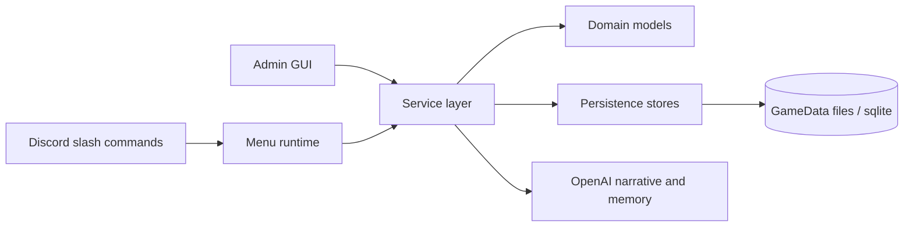

# The Architect

A turn-based strategy game in Python, played through a Discord bot with a bundled Tkinter admin editor.

## Setting and premise
The Architect is a turn-based strategy game in which characters use nanomachines to level up their bodies beyond normal human limits to do battle. This is set in the current day and age. Combat uses medieval style weapons, and new nanomachine-enhanced versions of these weapons and equipment become available as character level increases. In a monsters-coming-out-of-portal apocalypse, modern weapons become ineffective against higher-level monsters, so characters must use nanomachine-enhanced weapons despite their anachronistic appearance.

## Index
- [Quickstart](#quickstart)
- [Entry points](#entry-points)
- [Commands](#commands)
- [Subsystem docs](#subsystem-docs)
- [Navigation router](#navigation-router)
- [Concept map](#concept-map)
- [Repo map](#repo-map)
- [Interfaces and boundaries](#interfaces-and-boundaries)
- [Tests](#tests)
- [Maintaining this README](#maintaining-this-readme)

## Quickstart
### Prerequisites
- Python: `3.14`
- OS deps: none beyond Python package installation
- Desktop UI: Tkinter must be available for the admin editor

### Setup
```bash
python -m pip install -r requirements-dev.txt
```

Create a local `.env` using `.env.example` and provide:
- `BOT_TOKEN` for the Discord bot
- `OPENAI_API_KEY` or `OPEN_AI_API_KEY` if you want memory/narration features enabled

## Entry points
- Run the game and admin GUI together: `python main.py`
- Main bootstrap: `main.py`
- Discord player entry points: `/menu` and `/play`
- Admin GUI bootstrap: `src.tools.admin.start_admin_gui_thread`
- Menu model package: `src.ui.menu`

## Commands
All commands assume you are at the repo root.

```bash
# install
python -m pip install -r requirements-dev.txt

# run the Discord bot and admin GUI
python main.py

# tests
python -m pytest -q

# lint
python -m ruff check .

# format
python -m ruff format .

# typecheck
python -m mypy main.py src tools tests
```

## Subsystem docs
- [Domain](src/domain/README.md)
- [Services](src/services/README.md)
- [Battle](src/services/battle/README.md)
- [Menu runtime](src/services/menu_runtime/README.md)
- [Persistence](src/persistence/README.md)
- [Admin editor](src/tools/admin/README.md)
- [UI menu models](src/ui/menu/README.md)
- [Bot views](src/bot/README.md)
- [Config and tuning](src/config/README.md)

## Navigation router
Use this when you know the task shape but do not yet know the code path.

| Task | Read first | Then inspect | Fast test |
|------|------------|--------------|-----------|
| `/menu`, menu buttons, modal flow | [Menu runtime](src/services/menu_runtime/README.md) | `src/services/menu_service.py`, `src/ui/menu/models.py` | `python -m pytest -q tests/test_menu_runtime.py tests/test_menu_view.py` |
| Battle math, mission battle flow, combat state | [Battle](src/services/battle/README.md) | `src/domain/combat/`, `src/services/battle_runtime_service.py` | `python -m pytest -q tests/test_battle_service.py tests/test_combat_simulator_service.py tests/test_power_rating_service.py` |
| Admin GUI editor behavior | [Admin editor](src/tools/admin/README.md) | `src/tools/admin/features/`, `src/tools/admin/shared/` | `python -m pytest -q tests/test_integration_tools.py` |
| Saves, catalogs, menu JSON, sqlite memory | [Persistence](src/persistence/README.md) | `src/domain/player_functions.py`, `GameData/` paths used by the store | `python -m pytest -q tests/test_active_battle_store.py tests/test_persistence_stores.py tests/test_player_memory_store.py tests/test_player_save.py` |
| Discord component rendering | [Bot views](src/bot/README.md) | `src/services/menu_runtime/interaction.py`, `src/services/battle_runtime_service.py` | `python -m pytest -q tests/test_menu_view.py tests/test_menu_runtime.py` |
| Tunables, emoji placeholders, shared config values | [Config and tuning](src/config/README.md) | `GameData/Tuning/`, call sites in `src/services/` and `src/domain/` | `python -m pytest -q tests/test_tuning_settings.py tests/test_menu_view.py` |

## Concept map


## Repo map
| Path | Responsibility |
|------|----------------|
| `main.py` | Runtime bootstrap for services, Discord commands, and admin GUI thread |
| `src/domain/` | Core models, state objects, serialization helpers, and gameplay-facing value types |
| `src/services/` | Application orchestration, combat flow, menu runtime, generation, and integrations |
| `src/persistence/` | File and sqlite persistence adapters for catalogs, saves, menus, tuning, and memory |
| `src/ui/menu/` | Menu data models shared by menu loading and runtime rendering |
| `src/tools/admin/` | Tkinter admin editor shell, feature screens, and shared editor widgets |
| `src/bot/` | Discord view components and bot-specific UI helpers |
| `src/config/` | Configuration constants and tunable-value loading |
| `GameData/` | Catalog data, menus, saves, tuning files, and generation source data |
| `tests/` | Unit and integration tests |
| `docs/` | Documentation support files and templates |
| `tools/` | One-off helper scripts and local tooling utilities |

## Interfaces and boundaries
### Core boundaries
- `src/domain` owns gameplay data shapes and stateful models. It should not take hard dependencies on Discord or Tkinter UI code.
- `src/services` orchestrates domain objects, persistence, Discord flows, and narrative integrations.
- `src/persistence` owns file and database access. Keep JSON/sqlite details here rather than in command handlers or UI code.
- `src/ui/menu` is model-only. Discord interaction behavior lives in `src/services/menu_runtime`.
- `src/tools/admin` is editor UI only. It should go through services instead of manipulating `GameData` files directly.

### Data and config assets
- `GameData/**/*.json` and `GameData/**/*.csv` are content and save assets, not refactor targets.
- `.env` is local configuration and must never be committed with live secrets.
- Tuning files under `GameData/Tuning` are runtime data, not code.

## Tests
- Full suite: `python -m pytest -q`
- Battle and combat: `python -m pytest -q tests/test_battle_service.py tests/test_combat_simulator_service.py tests/test_power_rating_service.py`
- Menu runtime: `python -m pytest -q tests/test_menu_runtime.py tests/test_menu_view.py`
- Persistence: `python -m pytest -q tests/test_active_battle_store.py tests/test_persistence_stores.py tests/test_player_memory_store.py tests/test_player_save.py`
- Admin/tooling smoke coverage: `python -m pytest -q tests/test_integration_tools.py`

## Maintaining this README
Update this README when:
- entry points or startup flow change
- install, run, lint, format, typecheck, or test commands change
- major subsystem boundaries move or are renamed
- required environment variables change

Agent checklist:
1. Read this file before opening code.
2. Read the relevant subsystem README next.
3. Limit initial code reads to the 3-5 files needed for the task.
4. If commands, entry points, interfaces, or subsystem ownership changed, update this README in the same change.
